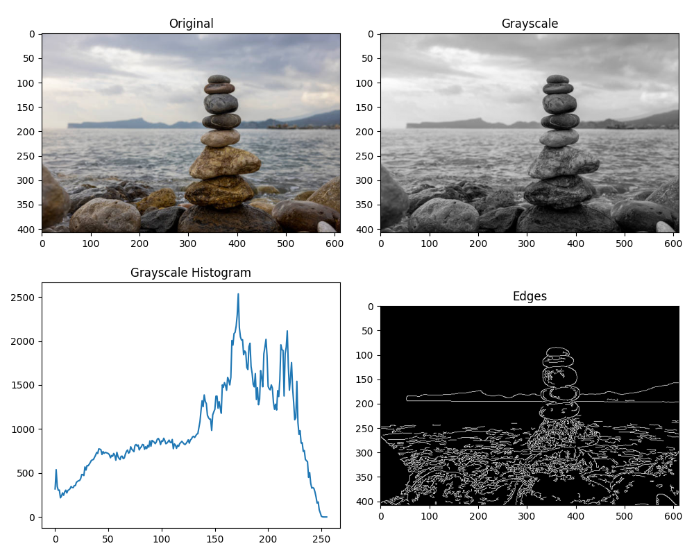

# GVC - Graphical and Visual Computing

This repository documents five core activities exploring digital image processing using **OpenCV** and **Matplotlib**.

## Result (Activity 4)
The image below demonstrates the full processing pipeline: original color input, grayscale conversion, intensity distribution (histogram), and Canny edge detection.

---

## Activity Summaries

### Activity 1: Image Basics
Focused on environment setup and basic manipulation. 
* **Key Tasks:** Opening images with various flags, converting to grayscale, accessing specific pixel values, and applying binary thresholding (Black & White).

### Activity 2: Edge Detection & Channel Splitting
Explored the structural components of an image.
* **Key Tasks:** Comparing four edge detection methods (Canny, Sobel, Laplacian) and splitting the image into separate Red, Green, and Blue visual channels.

### Activity 3: Histogram Comparison
Analyzed the tonal distribution of multiple files.
* **Key Tasks:** Loading `image.jpg` and `image.jpeg` to compare their color and intensity histograms within a single figure.

### Activity 4: Integrated Visualization
Combined multiple processing techniques into a single output.
* **Key Tasks:** Plotting the original, grayscale, histogram, and edges in a 2x2 grid to visualize how algorithms change the data.

### Activity 5: Metadata & Properties
Focused on image data and file properties.
* **Key Tasks:** Printing file metadata (filename, dimensions, format, and size) while applying the Canny operator to highlight primary edges.
